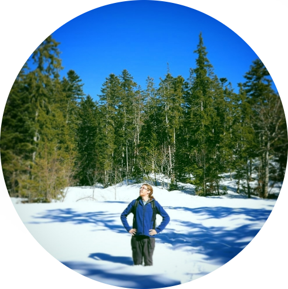

# Hello 👋

<i>I'm Corentin Bettiol, french full stack dev.</i>

I use [django](https://github.com/django/django) & [django-cms](https://github.com/divio/django-cms),

I created [Django check SEO](https://github.com/kapt-labs/django-check-seo),

I like climbing & hiking,

and I have a [personal website](https://l3m.in) (in french).

----

# Links

## dev-related

* [dev.to](https://dev.to/corentinbettiol)

* [personnal website](https://l3m.in)

* [stackoverflow](https://stackoverflow.com/users/6813732/sodimel)

* [gitlab](https://gitlab.com/sodimel/)

## social

* [linkedin](https://www.linkedin.com/in/corentinbettiol)

* [twitter](https://twitter.com/sodimel)

----

Latest dev.to blog posts:

[How to make super duper shadows for your screenshots](https://dev.to/corentinbettiol/how-to-make-super-duper-shadows-for-your-screenshots-2m17)

[Django check SEO - a cool django/django-cms plugin](https://dev.to/corentinbettiol/django-check-seo-3ljk)

----

